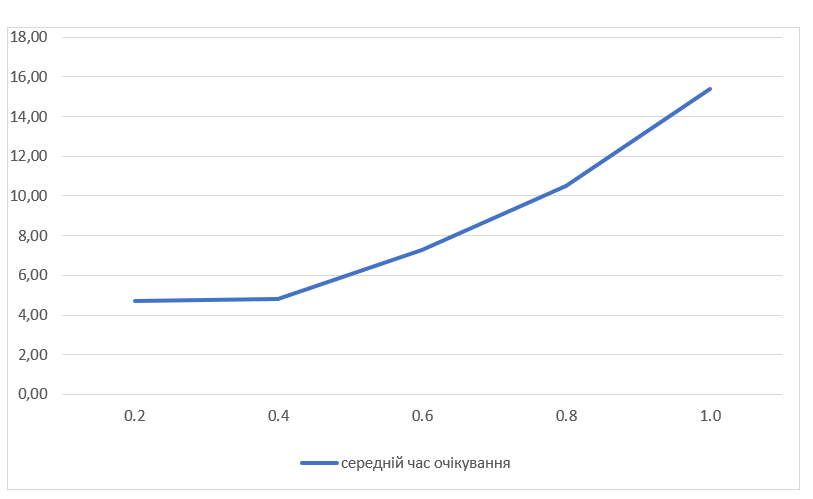
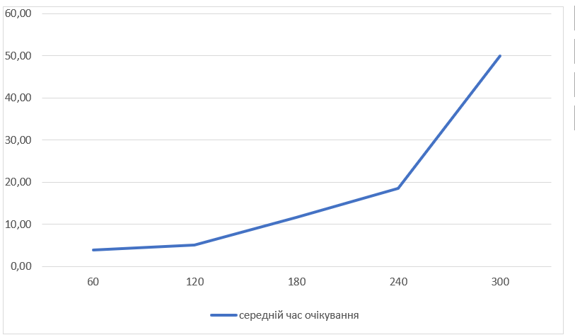
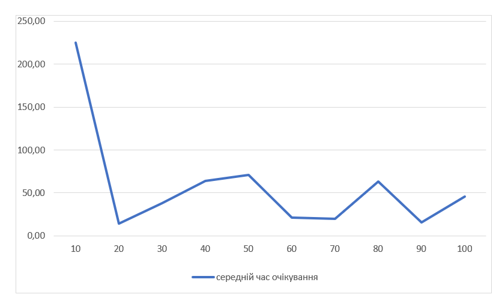

## Комп'ютерні системи імітаційного моделювання
## СПм-22-4, **Микитишин Василь Юрійович**
### Лабораторна робота №**1**. Опис імітаційних моделей та проведення обчислювальних експериментів

 

### Варіант 1, модель у середовищі NetLogo:
[Traffic Grid](http://www.netlogoweb.org/launch#http://www.netlogoweb.org/assets/modelslib/Sample%20Models/Social%20Science/Traffic%20Grid.nlogo)

 

### Вербальний опис моделі:
Ця модель є симуляцією руху транспорту та управління світлофорами в сітці доріг. Вона створює віртуальні машини, які пересуваються сіткою доріг і підпорядковуються правилам руху, що встановлюються світлофорами на перехрестях. Кожен aвтомобіль може рухатися вгору або вправо.

### Керуючі параметри:
- **grid-size-x, grid-size-y** встановлює кількість вертикальних та горизонтальних доріг
- **num-cars** кількість автомобілів у симуляції 
- **power?** перемикає живлення для світлофорів
- **ticks-per-cycle** встановлює кількість тактів, які пройдуть для кожного циклу світлофора.
- **speed-limit** встановлює максимальну швидкість для автомобілів
- **current-auto?** перемикає поточний світлофор в автоматичний режим, де він змінюється один раз за цикл
- **current-phase** керує моментом зміни поточного світлофора, якщо він знаходиться в авторежимі. Значення повзунка є відсотком проходження кожного циклу, при якому світлофор повинен змінюватися

### Внутрішні параметри:
- **grid-x-inc, grid-y-inc** кількість патчів між двома дорогами у напрямку x та у
- **acceleration** константа, яка контролює, на скільки автомобіль прискорюється або сповільнюється, якщо він має прискорюватися чи сповільнюватися
- **num-cars-stopped** кількість автомобілів, які зупиняються під час одного проходу через процедуру go
- **current-light** поточний вибраний світлофор
- **intersections** набір агентів, що містить патчі, які є перехрестями
- **roads** набір агентів, що містить патчі, які є дорогами
- **speed** швидкість черепахи
- **up-car?** true, якщо машина рухається вниз, і false, якщо вона рухається праворуч
- **wait-time** кількість часу з моменту останнього руху машини

### Показники роботи системи:
- **STOPPED CARS** графік, який відображає кількість зупинених автомобілів
- **AVERAGE SPEED OF CARS** графік, який відображає середню швидкість автомобілів
- **AVERAGE WAIT TIME OF CARS** графік, який відображає середній час зупинки автомобілів
  
### Примітки:
- Коли машини зупиняються на світлофорі, а потім починають рух, затор може рухатися назад, навіть якщо машини рухаються вперед.
- Коли POWER? вимкнено, і на дорогах досить багато машин, зазвичай відбувається "глухий кут", тобто, ситуація в якій жодна машина не може зрушити з місця і все "місто стоїть".
  
### Недоліки моделі:
- Наразі максимальне обмеження швидкості (знаходиться на повзунку SPEED-LIMIT) для автомобілів становить 1,0. Це доволі неприємне обмеження.
- Коли автомобіль доїжджає до краю світу, він знову з’являється на іншому боці. Це не дуже реалістично. Було б краще, якби він просто зникав на краю світу, а нові автомобілі виникали на іншому краю у випадкових місцях у випадкові інтервали часу.
- У моделі на світлофорах немає жовтого кольору.

 

## Обчислювальні експерименти
### 1. Вплив обмеження швидкості на середній час очікування автомобілів
Досліджується вплив обмеження швидкості на середній час очікування автомобілів протягом певної кількості тактів (1000)
Експерименти проводяться при 0.2-1.0 обмеженнях швидкості, з кроком 0.2, усього 5 симуляцій.  
Інші керуючі параметри мають значення за замовчуванням:
- **grid-size-x**: 5
- **grid-size-y**: 5
- **num-cars**: 200
- **power?**: on
- **ticks-per-cycle**: 20
- **current-auto?**: on
- **current-phase**: 0

<table>
<thead>
<tr><th>Обмеження швидкості</th><th>Середній час очікування</th></tr>
</thead>
<tbody>
<tr><td>0.2</td><td>4.73</td></tr>
<tr><td>0.4</td><td>4.80</td></tr>
<tr><td>0.6</td><td>7.30</td></tr>
<tr><td>0.8</td><td>10.50</td></tr>
<tr><td>1.0</td><td>15.40</td></tr>
</tbody>
</table>

Графік наочно показує, що чим менше обмеження швидкості (чим швидше машини рухаються), тим більше часу автомобілі проводять у черзі чекаючи на світлофорі або в інших умовах, що, насправді, контрінтуїтивно. Але, подивившись на модель уважніше, стає зрозумілим, що не зважаючи на обмеження швидкості, машини доїзжають від початку до кінця приблизно за однакові відрізки часу, тобто, при низькій швидкості машини хоч і повільно, але їдуть завжди, а при високій швидкості більше витрачають часу стоячи на червоний колір світлофора.

### 2.  Вплив кількості автомобілів на дорозі на середній час очікування автомобілів
Досліджується Вплив кількості машин на дорозі на середній час очікування автомобілів протягом певної кількості тактів (1000).
Експерименти проводяться при 60-300 автомобілях, з кроком 60, усього 5 симуляцій.  
Інші керуючі параметри мають значення за замовчуванням:
- **grid-size-x**: 5
- **grid-size-y**: 5
- **speed-limit**: 1.0
- **power?**: on
- **ticks-per-cycle**: 20
- **current-auto?**: on
- **current-phase**: 0

<table>
<thead>
<tr><th>Кількість автомобілів</th><th>Середній час очікування</th></tr>
</thead>
<tbody>
<tr><td>60</td><td>4.0</td></tr>
<tr><td>120</td><td>5.03</td></tr>
<tr><td>180</td><td>11.6</td></tr>
<tr><td>240</td><td>18.5</td></tr>
<tr><td>300</td><td>435</td></tr>
</tbody>
</table>

*Графік не точно передає наявні дані. При значенні 450 він стає нечитабельним. Тому було вирішено, знехтувавши точністю графіка, зробити його більш наочним.*

Графік наочно показує, що зростання кількості автомобілів призводить до збільшення середнього часу очікування. Це стає видимим при порівнянні значень середнього часу очікування для різної кількості автомобілів. З 60 до 240 автомобілів середній час очікування зростає від 4.0 до 18 одиниць. А при значенні в 300, майже завжди виникає пробка по всьому місту.

### 3. Вплив швидкості перемикання світлофора на середній час очікування автомобілів
Досліджується вплив швидкості перемикання світлофора на середній час очікування автомобілів протягом певної кількості тактів (1000)
Експерименти проводяться при 10-100 тіків для перемикання світлофора, з кроком 10, усього 10 симуляцій.  
Інші керуючі параметри мають значення за замовчуванням:
- **grid-size-x**: 5
- **grid-size-y**: 5
- **num-cars**: 150
- **power?**: on
- **speed-limit**: 1.0
- **current-auto?**: on
- **current-phase**: 0

<table>
<thead>
<tr><th>Тіки для перемикання світлофора</th><th>Середній час очікування</th></tr>
</thead>
<tbody>
<tr><td>10</td><td>225</td></tr>
<tr><td>20</td><td>14</td></tr>
<tr><td>30</td><td>38</td></tr>
<tr><td>40</td><td>64</td></tr>
<tr><td>50</td><td>71</td></tr>
<tr><td>60</td><td>21</td></tr>
<tr><td>70</td><td>20</td></tr>
<tr><td>80</td><td>63</td></tr>
<tr><td>90</td><td>16</td></tr>
<tr><td>100</td><td>46</td></tr>
</tbody>
</table>

Графік наочно показує, що існує деяке оптимальне значення кількості тіків для перемикання світлофора, при якому середній час очікування мінімізується. У цьому випадку, наприклад, це може бути близько 60 тіків. Також існують значення, коли всі машини стають у пробку, це близько 10 тіків.
